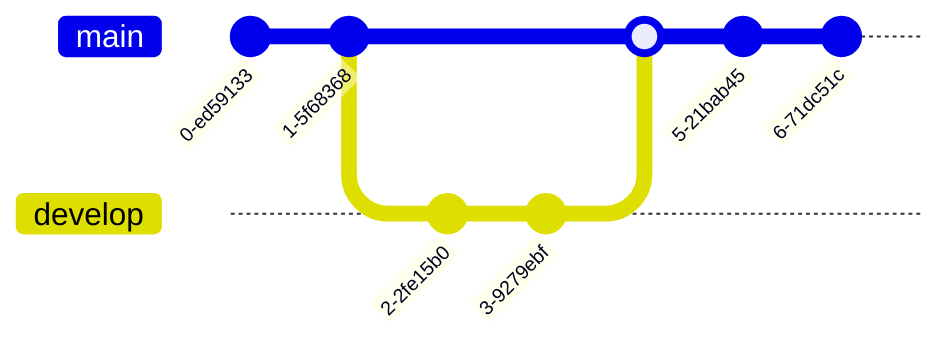

# SunStar Systems' Orion&trade; Enterprise Wiki (SSG Build Toolchain)

## TO BUILD THE OpenOffice.Org SITE to ./www (at ~1 GB/s, or 50 μs/file, on modern hardware)

```shell
   % SVN_URL=https://svn.apache.org/repos/asf/openoffice/ooo-site ./test.sh
```

First time thru this will run forever, because the source tree in trunk needs
this patch:

```diff
Index: trunk/lib/view.pm
===================================================================
--- trunk/lib/view.pm (revision 1905280)
+++ trunk/lib/view.pm (working copy)
@@ -154,7 +154,7 @@
     my %args = @_;
     open my $fh, "content$args{path}" or die "Can't open $args{path}:$!";
     read $fh, my $content, -s $fh;
-    return $content, html => %args;
+    return $content, html => \%args;
 }

 sub breadcrumbs {
```

Compare with (content-trimmed-down) 60x slower JBake build port at <https://builds.apache.org/job/OpenOffice>.

### TO generate the link topology graph (SVGZ) for OpenOffice.Org, run

```shell
    % ./links2dotcfg.pl '^$' index ""
```
## Buildable text content should be UTF-8

## Perl prerequisites

- sealed v4.1.8
- IO::Select
- YAML::XS
- APR::Request (which has a build dependency on mod_perl)


### (IoC) Build API

Core Build Engine:

- provide `@path::patterns` in lib/path.pm
- provide `view code` in lib/view.pm (typically derived from `SunStarSys::View`)
- grok the associated API you need to conform to as expressed below

```perl
  ...

  my $path = "/path/to/source/file";

  for my $p (@path::patterns) {
    my ($re, $method, $args) = @$p;
    next unless $path =~ $re;
    ++$matched;

    my ($content, $mime_extension, $new_args, @new_sources) = view->can("$method")->(path => $path, lang => $lang, %$args);

... write UTF $content to target file with associated $mime_extension file-type
  }

  copy($path, "$target_base$path") unless $matched;

  ...

```

## HOWTO

### Create a source tree with the following layout

```yaml
   - trunk/
       - content/
       - cgi-bin/ (optional)
       - lib/
           - path.pm
           - view.pm
       - templates/
```

1. Launch the markdownd.js server in the background.
1. Run build_site.pl --source-base /path/to/sources/trunk --target-base /wherever/you/want

## Python 3.8 Port Plan

### Reuse /lib

```yaml
    - lib/
      - SunStarSys/
        - View.py (volunteers needed!)
        - Util.py (I will handle this)

    - build_file.py (volunteers?)
    - build_site.py (volunteers?)
```

### Site Build Developer API

```yaml
    - lib/path.py:
      - NOT OO, only data structure population
      - path.patterns:
        - array of arrays:
          - outer array:
            - orders priority of pattern matches from first elt of inner arrays
            - falls back to SunStarSys.Util.copy_if_newer behavior
          - inner arrays:
            - pattern: regex to text source file's path against
            - view: method name in view class to invoke
            - args: dict of **args passed to view method in prior slot
      - path.dependencies:
        - dict of arrays:
        - keys are paths to sources rooted in source tree's "content" dir
        - values are array of similarly rooted files the key depends on

    - lib/view.py:
      - OO: view class should inherit from SunStarSys.View
      - defines class methods to be invoked by build script as follows <
        s = view.getattr(method, None)
        args[path] = path
        content, ext, args = s(**args)
```

Markdown-based mermaid+mindmap rendering tests:





